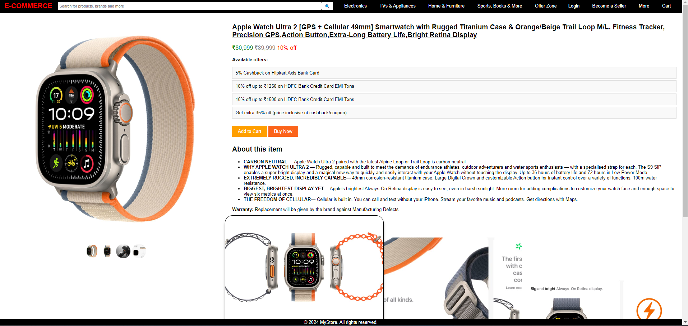

# E-commerce-Product-Page
## Preview



This repository contains the HTML, CSS, and JavaScript code for an e-commerce product page. The page is designed to provide a visually appealing and responsive interface for showcasing products, complete with an image gallery, product details, offers, and interactive elements.

## Dive into the project
[](https://krishitdas.github.io/E-commerce-Product-Page/)<span><em>(Tap on 🔗 icon to view the project)</em></span>

## Overview

The e-commerce product page includes:
- A header with a logo, search bar, navigation links, and user actions.
- A main section displaying the product images and details.
- Interactive image gallery with thumbnail previews.
- Product information including price, offers, and a detailed description.
- Add to Cart and Buy Now buttons.
- A footer with basic site information.

## Features

- **Responsive Design**: The page is designed to be responsive and visually appealing on various devices.
- **Interactive Image Gallery**: Users can click on thumbnails to view different images of the product. Navigation buttons allow cycling through the images.
- **Offers and Discounts**: Special offers and discounts are prominently displayed.
- **Detailed Product Information**: Comprehensive details about the product, including its features and warranty information.
- **User-friendly Interface**: Intuitive and easy-to-use interface with hover effects and transitions for a better user experience.

## Technologies Used

- **HTML**: Structure of the webpage.
- **CSS**: Styling of the webpage for a polished and responsive design.
- **JavaScript**: Interactivity for the image gallery.

## Setup Instructions

To view or use the e-commerce product page locally, follow these steps:

1. **Clone the repository**:
    ```bash
    git clone https://github.com/your-username/e-commerce-product-page.git
    ```

2. **Navigate to the project directory**:
    ```bash
    cd e-commerce-product-page
    ```

3. **Open the `index.html` file in your web browser**:
    - You can double-click the `index.html` file.
    - Or, open it with a live server in your code editor (e.g., VSCode).

## File Structure
e-commerce-product-page/
│
├── index.html # Main HTML file for the e-commerce page
├── styles.css # CSS file for styling the page
├── script.js # JavaScript file for interactive elements
└── README.md # This README file


## Code Explanation

### HTML (`index.html`)

The HTML file contains the structure of the e-commerce product page, including:

- **Header**: Logo, search bar, navigation links, and user actions.
- **Main Section**: Image gallery, product details, offers, description, and warranty information.
- **Footer**: Basic site information.

### CSS (`styles.css`)

The CSS file styles the e-commerce page with a focus on responsiveness, visual appeal, and user experience. Key styles include:

- **Header Styling**: Flexbox layout for header elements.
- **Product Page Layout**: Flexbox for the main product display and details.
- **Interactive Elements**: Hover effects, transitions, and responsive design adjustments.

### JavaScript (`script.js`)

The JavaScript file adds interactivity to the image gallery, allowing users to click on thumbnails and navigate through images using next and previous buttons. Key functionalities include:

- **Thumbnail Click Event**: Updates the main image based on the clicked thumbnail.
- **Next/Previous Buttons**: Cycles through the images in the gallery.

## Contributing

If you'd like to contribute to this project, please fork the repository and use a feature branch. Pull requests are welcome.

## License

This project is open source and available under the [MIT License](LICENSE).
---
